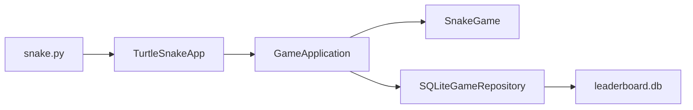

# Snake — Project Summary

## Overview

**Snake** is a desktop Snake game written in **Python 3.12**, rendered with the standard library **`turtle`** module (Tkinter). It has no third-party runtime dependencies: only stdlib (`turtle`, `sqlite3`, hashing, etc.). The project is managed with **`uv`** and started via `snake.py`.

## Purpose

Classic Snake on a square board, with menus, pause/settings, a local leaderboard, and a coin economy (earn coins from food, spend them to revive after game over).

## Architecture

The codebase follows a **layered / ports-and-adapters** style:

| Layer | Role |
|--------|------|
| **`snake_game/domain`** | Pure game logic: board, snake movement, collisions, food/bonus spawns, scoring, pause/game-over |
| **`snake_game/application`** | `GameApplication` orchestrates sessions, user prefs, scores, coins, revive; `GameRepository` port |
| **`snake_game/infrastructure`** | SQLite (`leaderboard.db`), user/score/coin stores, device-based player ID |
| **`snake_game/ui`** | Turtle window, rendering, screens (menu, game, settings, leaderboard), input and navigation |

**Entry point:** `snake.py` wires repository → `GameApplication` → `TurtleSnakeApp`.

## Gameplay Features

- **Screens:** main menu, in-game view, pause overlay (resume / settings / main menu), settings, leaderboard.
- **Controls:** arrows to move; `P` / `Esc` for pause; `Enter` or UI to start; color shortcuts (`C`, `1`–`5`); name change (`N`); revive (`R`) when enough coins.
- **Economy:** food gives score and coins; optional bonus coins on the board; revive costs coins and keeps the current score.
- **Customization:** player display name, snake color, background color (persisted).

## Persistence & Identity

- **`leaderboard.db`:** users, high scores, coin balance, color/background preferences.
- **Player ID:** hashed hardware identifier when possible; otherwise `.player_id` file. No IP tracking.

## UI Stack

- **`turtle_window.py`** — window setup
- **`turtle_renderer.py`** — drawing
- **`turtle_app.py`** — event loop and keyboard handling
- **`navigation.py`** — screen/button models; screen modules under `ui/screens/`

## Quality & Tooling

- **Tests:** `unittest` in `tests/` — domain direction rules and SQLite repository behavior.
- **Python pin:** `>=3.12,<3.13` (README notes Tkinter issues on some newer Homebrew Pythons).
- **Run:** `uv sync` then `uv run python snake.py`
- **Test:** `uv run python -m unittest discover -s tests`

## In Short

A **stdlib-only**, **layered** Snake game for local play or coursework: clean separation between rules, app services, SQLite persistence, and Turtle UI, with leaderboard and coin-based revive as the main extras beyond vanilla Snake.
